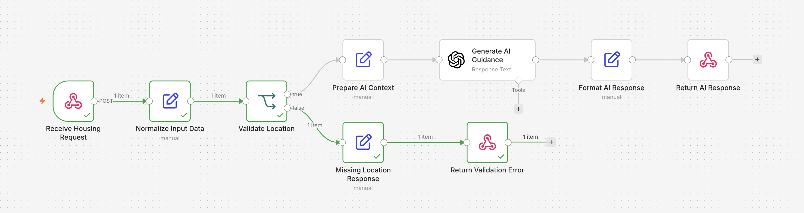

# AI Housing Assistance Workflow

An AI-powered automation workflow that receives housing assistance requests through an API endpoint, validates the input, and generates contextual housing guidance using the OpenAI API.

Built as a practical demonstration of API integration, workflow automation, conditional logic, JSON processing, and AI-assisted responses.

## How It Works

The workflow:

1. Receives a POST request through an n8n webhook.
2. Normalizes the incoming JSON data.
3. Checks whether a location was provided.
4. If the location is missing, returns a structured validation response.
5. If the location is available, prepares the user data for the AI model.
6. Sends the request to the OpenAI API.
7. Formats the AI-generated guidance.
8. Returns a clean JSON response.

## Tech Stack

- n8n
- OpenAI API
- REST/Webhooks
- JSON
- cURL

## Example Request

```bash
curl -X POST http://localhost:5678/webhook-test/housing-assistant \
-H "Content-Type: application/json" \
-d '{
  "name": "Sarah",
  "city": "Houston",
  "household_size": 3,
  "monthly_income": 2400,
  "need": "rental assistance"
}'
```

## Example Response

```json
{
  "status": "ready",
  "message": "Based on your situation, here are some housing assistance resources you might consider exploring..."
}
```

## Input Validation

If the location is missing, the workflow follows a separate validation branch:

```json
{
  "status": "missing_location",
  "message": "I need your city before I can search for housing assistance resources."
}
```

## AI Safety

The model is instructed not to guarantee eligibility for housing programs. Final eligibility decisions are left to the relevant housing agencies.

## Workflow

The workflow uses conditional branching to separate valid requests from requests that require additional information.

### Workflow Architecture


